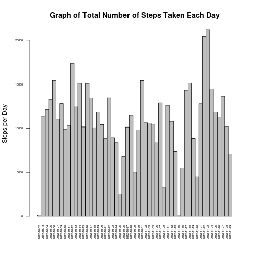
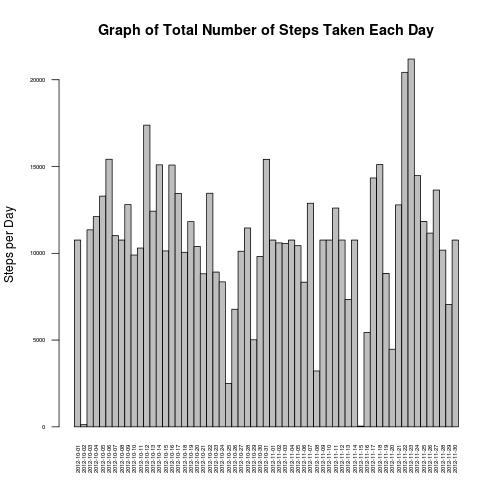
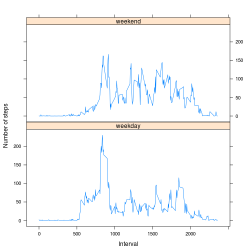

### Loading and preprocessing the data

#### Show any code that is needed to
1. Load the data (i.e. read.csv())
2. Process/transform the data (if necessary) into a format suitable for your analysis

(1.) The data is loaded directly from the zip-file and so character data will not be converted to factors.  

```r
data <- read.table(unz("./activity.zip", "activity.csv"), header=T, sep=",", stringsAsFactors=FALSE)
```

(2.) In this case the data needs no prosessing. 

A portion of the original data is here (every 1000th row):

```r
data[ c( TRUE,rep(FALSE,999) ) ,]
```

```
##       steps       date interval
## 1        NA 2012-10-01        0
## 1001      0 2012-10-04     1120
## 2001      0 2012-10-07     2240
## 3001      0 2012-10-11     1000
## 4001      0 2012-10-14     2120
## 5001    608 2012-10-18      840
## 6001     12 2012-10-21     2000
## 7001      0 2012-10-25      720
## 8001      0 2012-10-28     1840
## 9001     NA 2012-11-01      600
## 10001    NA 2012-11-04     1720
## 11001     0 2012-11-08      440
## 12001     0 2012-11-11     1600
## 13001     0 2012-11-15      320
## 14001    39 2012-11-18     1440
## 15001     0 2012-11-22      200
## 16001     0 2012-11-25     1320
## 17001     0 2012-11-29       40
```
### What is mean total number of steps taken per day?

For this part of the assignment, you can ignore the missing values in the dataset.

1. Make a histogram of the total number of steps taken each day

2. Calculate and report the mean and median total number of steps taken per day

Ignore the missing values  

```r
data_complete <-data[complete.cases(data),]
```


(1.) Make the histogram. Here I use the barlpot to make the histogram. Steps per day is counted with the aggregate- function.


```r
steps_per_day <- aggregate(steps ~ date, data_complete, sum)
with(steps_per_day, {
    par(las=2, cex.axis=0.50)
    barplot(
        height=steps,
        main="Graph of Total Number of Steps Taken Each Day",
        xlab="",
        ylab="Steps per Day",
        names.arg=as.vector(date),
        space=c(0)
        )
    })
```

 

(2.) Calculate and report the mean and median total number of steps taken per day. The values are rounded to the nearest integer.


```r
paste("The mean is", round(mean(steps_per_day$steps,0)))
```

```
## [1] "The mean is 10766"
```

```r
paste("The median is", round(median(steps_per_day$steps,0)))
```

```
## [1] "The median is 10765"
```
### What is the average daily activity pattern?

1. Make a time series plot (i.e. type = "l") of the 5-minute interval (x-axis) and the average number of steps taken, averaged across all days (y-axis)

2. Which 5-minute interval, on average across all the days in the dataset, contains the maximum number of steps?

(1.) Aggregate the data and make the time series plot.


```r
aggr_interval_steps <- aggregate(steps ~ interval, data_complete, mean)
with(aggr_interval_steps, {
    par(las=1, cex.axis=0.7)
    plot(
        interval,
        steps,
        type="l",
        main="Average number of steps averaged across all days",
        xlab="Start time of the 5-minute Interval 24-hour clock",
        ylab="Average number of steps taken",
        axes=FALSE
    )
}
)
axis(1,at = seq(0, 2400, by = 100),labels="0":"24")
axis(2,at = seq(0, 200, by = 50))
```

 

(2.) Which 5-minute interval, on average across all the days in the dataset, contains the maximum number of steps?


```r
in_time <-aggr_interval_steps$interval[ which.max(aggr_interval_steps$steps)]
in_timeh<-as.integer(in_time/100)
in_times <-sprintf("%2i:%2i", in_timeh,in_time-100*in_timeh)
paste("Max steps taken in 5 minutes interval in slot", 
      which.max(aggr_interval_steps$steps), "i.e. at", in_times)
```

```
## [1] "Max steps taken in 5 minutes interval in slot 104 i.e. at  8:35"
```
### Imputing missing values

Note that there are a number of days/intervals where there are missing values (coded as NA). The presence of missing days may introduce bias into some calculations or summaries of the data.  

1. Calculate and report the total number of missing values in the dataset (i.e. the total number of rows with NAs)

2. Devise a strategy for filling in all of the missing values in the dataset. The strategy does not need to be sophisticated. For example, you could use the mean/median for that day, or the mean for that 5-minute interval, etc.

3. Create a new dataset that is equal to the original dataset but with the missing data filled in.

4. Make a histogram of the total number of steps taken each day and Calculate and report the mean and median total number of steps taken per day. Do these values differ from the estimates from the first part of the assignment? What is the impact of imputing missing data on the estimates of the total daily number of steps?   

(1.) Report the total number of missing values.

```r
paste("The total number of rows with NAs", nrow(data)-nrow(data_complete),".")
```

```
## [1] "The total number of rows with NAs 2304 ."
```
(2.) Missing values are replaced by the mean value of steps taken in that 5 minute slot. The mean values are rounded to the nearest integer. The tapply function is utilized.


```r
stepcol <- data.frame(data$steps)
stepcol[is.na(data),] <- round(tapply(data$steps,data$interval,FUN=mean,na.rm=TRUE))
```
(3.) A new data frame "data1" is created.

```r
data1 <- cbind(stepcol, data[,2:3])
colnames(data1) <- colnames(data)
```

A portion of the new data is here (every 1000th row):

```r
data1[ c( TRUE,rep(FALSE,999) ) ,]
```

```
##       steps       date interval
## 1         2 2012-10-01        0
## 1001      0 2012-10-04     1120
## 2001      0 2012-10-07     2240
## 3001      0 2012-10-11     1000
## 4001      0 2012-10-14     2120
## 5001    608 2012-10-18      840
## 6001     12 2012-10-21     2000
## 7001      0 2012-10-25      720
## 8001      0 2012-10-28     1840
## 9001     31 2012-11-01      600
## 10001    73 2012-11-04     1720
## 11001     0 2012-11-08      440
## 12001     0 2012-11-11     1600
## 13001     0 2012-11-15      320
## 14001    39 2012-11-18     1440
## 15001     0 2012-11-22      200
## 16001     0 2012-11-25     1320
## 17001     0 2012-11-29       40
```

(4.) Make a histogram of the total number of steps taken each day.


```r
steps_per_day1 <- aggregate(steps ~ date, data1, sum)
with(steps_per_day1, {
    par(las=2, cex.axis=0.50)
    barplot(
        height=steps,
        main="Graph of Total Number of Steps Taken Each Day",
        xlab="",
        ylab="Steps per Day",
        names.arg=as.vector(date),
        space=c(0)
        )
    })
```

 

Calculate and report the mean and median total number of steps taken per day. The values are rounded to the nearest integer.


```r
paste("The mean is", round(mean(steps_per_day1$steps,0)))
```

```
## [1] "The mean is 10766"
```

```r
paste("The median is", round(median(steps_per_day1$steps,0)))
```

```
## [1] "The median is 10762"
```
*Do these values differ and what is the impact of imputing missing data on the estimates?*    

The mean value was before imputing 10766 and after 10766 so difference was 0 and the median value was before 10765 and after 10762 with the difference of  3 which means that the impact was very small.  


### Are there differences in activity patterns between weekdays and weekends?

For this part the weekdays() function may be of some help here. Use the dataset with the filled-in missing values for this part.

1. Create a new factor variable in the dataset with two levels – “weekday” and “weekend” indicating whether a given date is a weekday or weekend day.

2. Make a panel plot containing a time series plot (i.e. type = "l") of the 5-minute interval (x-axis) and the average number of steps taken, averaged across all weekday days or weekend days (y-axis). See the README file in the GitHub repository to see an example of what this plot should look like using simulated data.

(1.) Create the factor variable and then aggregate the data.


```r
data1$type_of_day<- as.factor(
    ifelse (weekdays(as.Date(data1$date)) %in% c('Saturday','Sunday'),"weekend","weekday")
    ) 

factored_steps <- aggregate(
    data=data1,
    steps ~ type_of_day + interval,
    FUN=mean
    )
```

(2.) Make the plot.


```r
library("lattice")

xyplot(
    type="l",
    data=factored_steps,
    steps ~ interval | type_of_day,
    xlab="Interval",
    ylab="Number of steps",
    layout=c(1,2)
    )
```

 
